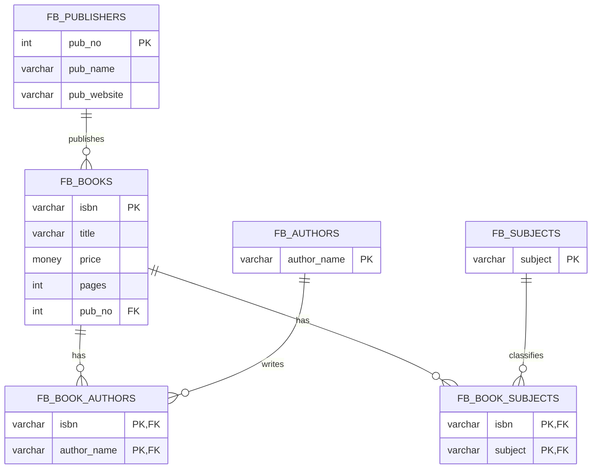
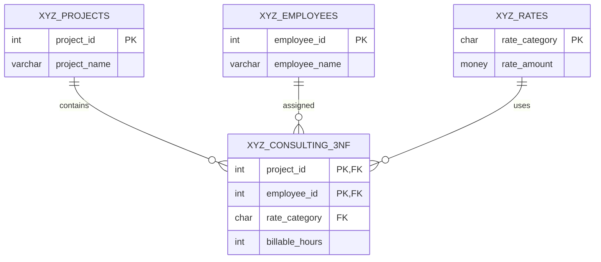

# Database Design & ERD

**Course:** IST 659 — Data Administration Concepts and Database Management  
**Project:** SQL Relational Database Design & Normalization

This document explains the final relational structures represented in the portfolio SQL scripts. The diagrams use the tables and constraints present in the verified SQL source.

## 1. FudgeBooks — normalized relational design

### Original design problem

The original `fudgenbooks` table stores multiple authors in separate columns (`author1`, `author2`, `author3`), multiple subjects in one comma-delimited column, and publisher attributes alongside every book. The normalization script separates these concepts into book, publisher, author, and subject tables plus bridge tables.

### Final ERD



### Transformation techniques

| Source structure | Normalized structure | Technique used |
|---|---|---|
| `author1`, `author2`, `author3` | `fb_authors` | `UNION` |
| Multiple author columns per book | `fb_book_authors` | `UNPIVOT` |
| Comma-delimited `subjects` | `fb_subjects` | `STRING_SPLIT` + `CROSS APPLY` |
| Book/subject associations | `fb_book_subjects` | `STRING_SPLIT` + bridge table |
| Repeated publisher attributes | `fb_publishers` | `DISTINCT` + lookup table |
| Book attributes | `fb_books` | `SELECT INTO` from normalized source |

The verified source explicitly creates the author lookup with `UNION`, the book/author bridge with `UNPIVOT`, the subject lookup with `STRING_SPLIT`, and the book/subject bridge with `STRING_SPLIT`.

### Key relationships

- `fb_books.pub_no` → `fb_publishers.pub_no`
- `fb_book_authors.isbn` → `fb_books.isbn`
- `fb_book_authors.author_name` → `fb_authors.author_name`
- `fb_book_subjects.isbn` → `fb_books.isbn`
- `fb_book_subjects.subject` → `fb_subjects.subject`

These foreign keys are added after the migration steps in the verified source.

---

## 2. XYZ Consulting — normalized relational design

### Original design problem

The original `xyz_consulting` table uses `(project_id, employee_id)` as its composite primary key while storing project names, employee names, and rate amounts in the same table. The normalization process separates project, employee, and rate information from the project/employee relationship.

### Final ERD



### Normalization path

```text
xyz_consulting
      |
      +--> xyz_projects
      |
      +--> xyz_employees
      |
      +--> xyz_consulting_2nf
                  |
                  +--> xyz_rates
                  |
                  +--> xyz_consulting_3nf
```

The verified source creates `xyz_projects`, `xyz_employees`, and `xyz_consulting_2nf`, then derives `xyz_rates` and `xyz_consulting_3nf`.

### Key relationships

- `xyz_consulting_3nf.project_id` → `xyz_projects.project_id`
- `xyz_consulting_3nf.employee_id` → `xyz_employees.employee_id`
- `xyz_consulting_3nf.rate_category` → `xyz_rates.rate_category`

The final relationship table uses `(project_id, employee_id)` as its primary key, with foreign keys to all three lookup/parent tables.

---

## 3. Portfolio takeaway

The two exercises demonstrate a common database-design workflow:

1. Identify attributes and dependencies in a denormalized source table.
2. Separate entities and lookup data into their own tables.
3. Use bridge tables for multi-valued relationships.
4. Define primary keys for entity identity.
5. Add foreign keys to enforce referential relationships after migration.
6. Preserve the original SQL so the portfolio version can be traced back to the submitted work.


